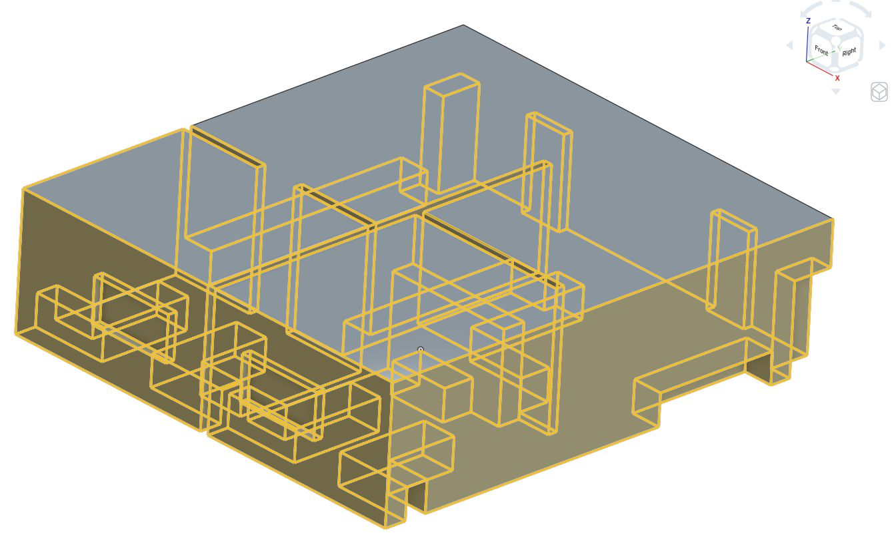
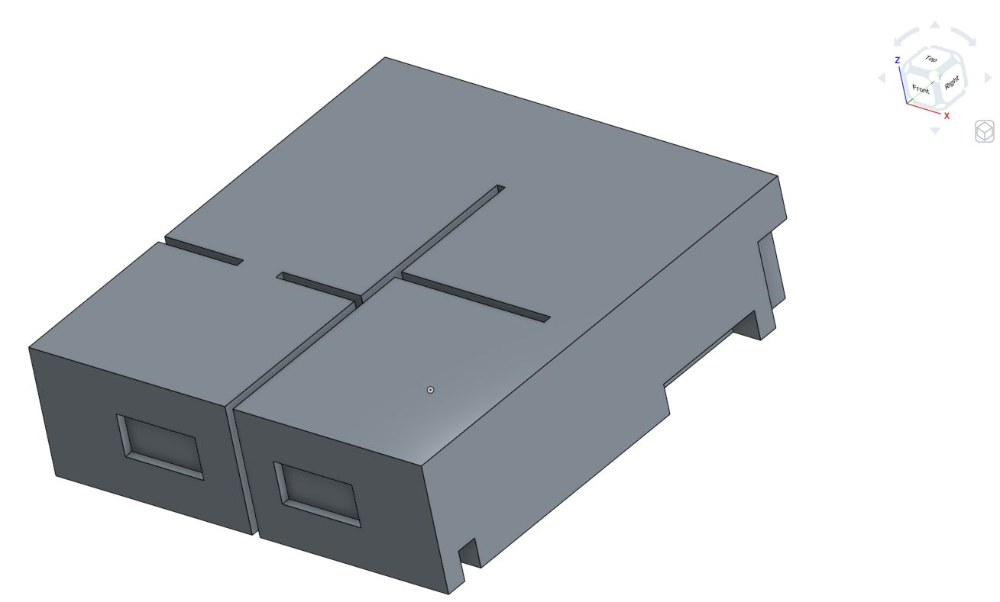
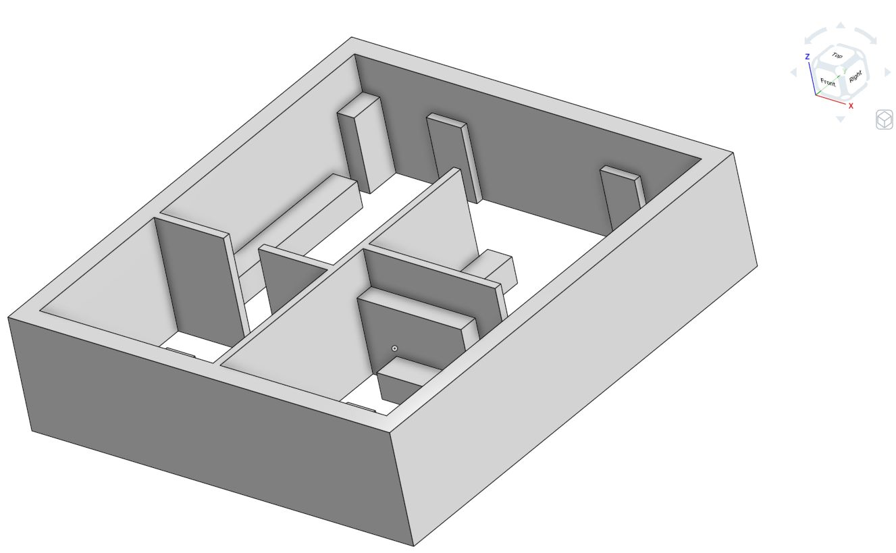
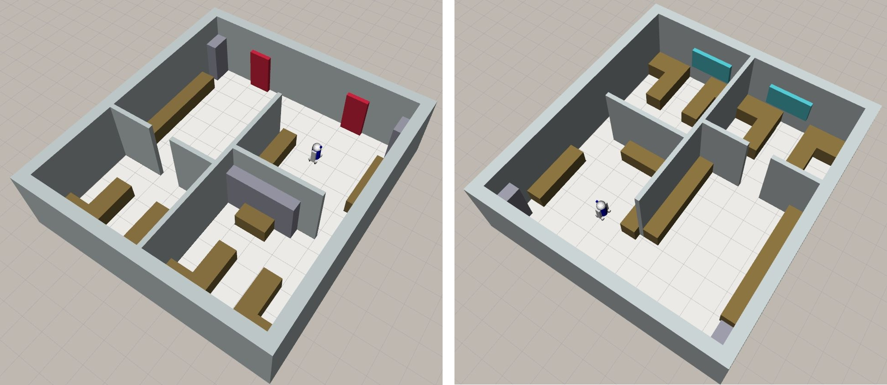
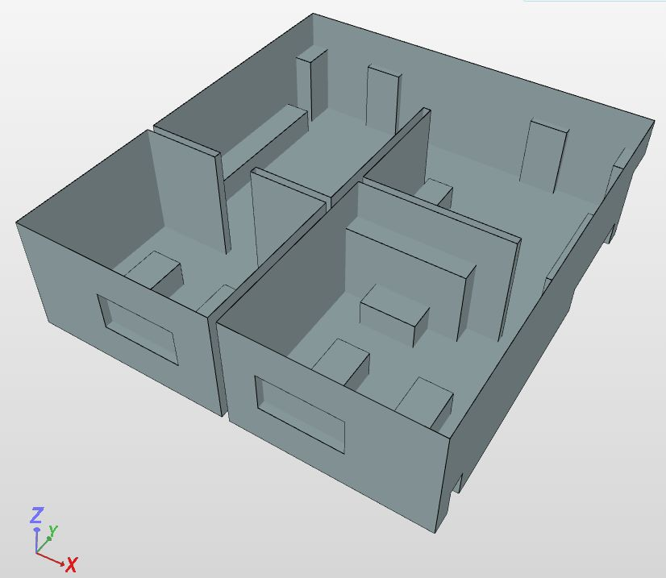
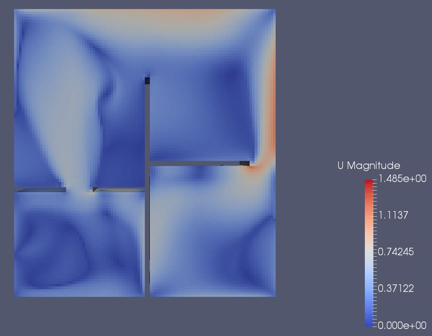
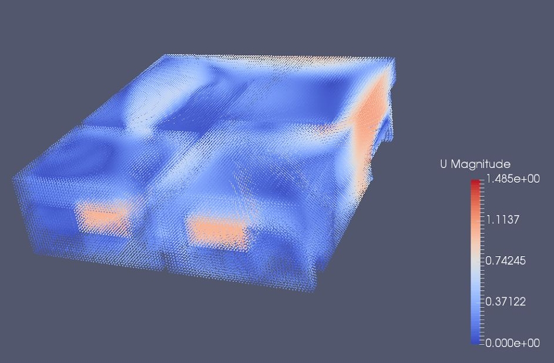

<br>
<br>
<br>
<br>

# GADEN TUTORIAL
# HOW TO SET UP YOUR OWN SIMULATIONS

This document is a guide for creating a new environment, setting up the wind conditions and generating the desired gas dispersion within it with Gaden. It is targeted at people who have little or no experience with CFD and CAD design.

It is assumed that you have read and understood the general mechanism of [Gaden](http://www.mdpi.com/1424-8220/17/7/1479) and that you have downloaded and compiled the [GADEN ROS pkgs](https://github.com/MAPIRlab/gaden).


If you use Gaden in your research, please cite the paper:

> J. Monroy, V. Hernandez-Bennetts, H. Fan, A. Lilienthal, J. Gonzalez-Jimenez, GADEN: A 3D Gas
Dispersion Simulator for Mobile Robot Olfaction in Realistic Environments. MDPI Sensors, vol. 17,
no. 7: 1479, pp. 1--16, 2017

---

## 1. CAD MODEL

The generation of a CAD model of the environment is the first step on every GADEN simulation. There is a wide range of CAD tools available both online and offline and for different expertise levels. Regardless of your choice of tool, there are a couple of important things to be considered when generating the CAD model of our new environment:

1. It must be understood that the CAD model we are going to employ is composed of two parts. Part_1 represents the walls, furniture, and objects in general that give shape to the environment, while Part_2 represents the “inner” volume of the environment where the gases are going to be released. In general, this is achieved by creating multiple “parts” in the CAD design, one representing walls and obstacles, and then obtaining the inner space as a different CAD part. If you are not an expert in CAD design (as it is my case), below you can find a very basic guide using a free online tool called [OnShape](https://cad.onshape.com).

2. Part_1 (objects) is used by GADEN to disperse gases, avoiding the filaments to pass through walls or furniture, while Part_2 is used as the input to CFD to get the wind flow conditions that will rule during the experiment.

3. You can define multiple CAD parts for Part_1, like for example walls, tables, doors, etc, but it is recommended to only one CAD part is exported for Part_2 (the inner volume).

### 1.1. CAD Model Example

In this simple example, we employ a free basic online application named [OnShape](https://cad.onshape.com), which has plenty of video tutorials. During this process, we may need to generate different CAD parts for the rooms, walls, furniture, obstacles, inlets, and outlets, etc., but keep in mind that we also need the CAD model of the free space left (inner volume). Having this in mind, the basic commands to use in the case of OnShape are:


- **Sketch** → Creates a new plane in which to draw parts. It is the basic and mandatory item for every CAD model. We will start with a rectangle (representing the inner volume), and drawing on it any desired obstacle (or we can also use another sketch for it). 
- **Extrude** → It allows adding volume to a Sketch. That is, we create a sketch plane, draw for example some obstacles on it, and then rise it up to a volume with the extrude option.
- **Boolean** → This option allows the intersection/add/subtraction of different parts of the CAD model. This is very interesting for merging parts and for obtaining the “inner” volume of the environment as a single CAD part.

To illustrate this phase, we show here the CAD models of an office-like environment. First,we obtain the CAD model of the inner volume (part_2, to be used for wind simulation), and then a second CAD part representing the obstacles and walls of our environment (part_1, to be used by GADEN filament simulator).




<br>

**PART_2**: Inner volume where wind flow would be simulated
using CFD (see Section 2). Most CFD tools only accept one
CAD part, so it is important that this CAD model is composed
of only 1 CAD part.

<br>
<br>
<br>
<br>


**PART_1**: The counterpart of the inner volume. It represents the walls and objects of the environment. It is used later in the “gaden_environment” pkg to visualize the environment and in “gaden_filament_simulator” to simulate the gas dispersion. Since every CAD part is represented in RVIZ with uniform color (no textures), we can split this CAD model into several parts, so each part can be colored differently.

<br>
<br>
<div style="width:400px; margin:0 auto;">



Pictures of the office-like environment as seen on RVIZ. Different CAD parts have been created andcolored to improve visualization.
</div>


## 2. CFD Wind Flow Simulation
The simulation of the wind flows within our newly created environment is a very complex process and depends on multiple parameters. The most common approach is to obtain a realistic approximation by means of Computational Fluid Dynamics (CFD). In this tutorial, we rely on the free and open access platform named OpenFOAM, arguably one of the most widespread and active open-source CFD projects. OpenFOAM takes as input the polyMesh of the inner volume of the environment, together with an extensive list of parameters that control the simulation process, such as boundary wind conditions, transient or steady simulation, turbulence level (i.e., Reynolds number), material properties, solver, etc. 

In general, non-experts in fluid dynamics may find this software too complex and with too many parameters, leading to unsuccessful simulations on many occasions. To relax this drawback, different graphical tools have appeared in the last years to control OpenFOAM from a more user-friendly interface. This is the case, for example, of [SimScale](https://www.simscale.com), a web-based tool which allows importing the inner volume of the environment as a CAD model, generating the mesh required by OpenFOAM, and configuring the most important parameters of the CFD simulation through an easy and intuitive interface. There are many other tools for interfacing OpenFOAM, or you can even work directly with it if you feel confident.

### 2.1 CFD Wind Flow Simulation Example
For those willing to work with SimScale, here you can find a very basic guide of the most important steps to follow in order to process our previously created inner volume CAD model, and obtain the desired wind flow simulation with OpenFOAM.
<br>
<br>



1. **Import CAD model to SimScale** (remember, only the inner volume part). This simplifies enormously the configuration of the environment in OpenFoam. There are different tools that allow you to create the polyMesh that OpenFOAM requires from a CAD model, here we employ the one integrated into the SimScale platform (see import options).

<br>
<br>


2. **Generate the PolyMesh** from the CAD model. It is recommended not to use the automatic mesh tool, but to try to obtain a more rigid grid based on cubes by using the “Hex-dominant parametric” tool, under the “Mesh-Creator” tab. The reason is that GADEN will work with a perfect 3D grid of cube cells, so as close the simulations of OpenFOAM are to this perfect grid, the better results we will obtain. <br><br> For the “Hex-dominant parametric” tool we need to define the outer environment dimensions (i.e the bounding box). Since we are only interested in wind simulations within the environment, we can set it to the real dimensions of the environment. Similarly, we need to set the number of cells on each dimension. Here we need to ensure that the environment dimensions are multiple of the cell dimension used, since in another case we will face problems with cells falling half in an obstacle, half in free space.

3. **Run Simulation:** Once the mesh has been generated, we need to set the simulation parameters. We focus on Fluid Dynamics - Incompressible flows - k-epsilon turbulence model - Transient simulation with the PIMPLE solver. Other options can also be selected according to the desired results. We select the mesh to simulate in it and set the medium as “AIR”. We also need to set the Boundary conditions, setting an input wind speed for the inlets of our environment, and constant pressure at the outlets. The walls and obstacles need also to be defined as “slip/non-slip” boundary conditions. As a tip set a short interval simulation step to allow a nice convergence of the algorithms, but allow an “adjustable timestep”, setting the max courant number to 0.7. Since this option will cause the time-steps to vary in length, set the writing parameters to “Adjustable at runtime” and select the time interval to save the data.


<div style="width:400px; margin:0 auto;">



Snapshot of the wind flow in the simulated environment
</div>
<br>

## 3. PostProcessing of Wind Flow Data



Once the CFD simulation is finished, download the result data (in OpenFoam format) to your computer. Then open it with the OpenFOAM viewer, called ParaView. With this application, you can ensure that the wind flow results are correct (at least that they seem to be representative of the boundary conditions you established). It must be noticed that for most simulations neither all the cells are perfect cubes, nor they are equally sized. To solve this problem (in GADEN we need a perfect 3D grid with uniform cell sizes), we can apply in ParaView the “cell centers” filter, and then export the data to a CSV file. This file will be a list of points (x,y,z) with their corresponding wind conditions (u,v,w). This way we simplify the problem of non-uniform cell dimensions. As a tip, when applying the “centerCells” filter, ensure that you have selected the option “Vertex Cells” to be able to display the center of the cells as points in the Paraview visualization frame. Snapshot of the wind flows in our new environment after applying the cell_centers filter in ParaView.

## 4. Pre-processing of GADEN Data
At this step, we have all the data we need to start the gas dispersal simulation, but we still need to get it to the right format for GADEN. That is, we need to turn the CAD models describing the environment (walls, furniture, etc) and the point cloud of wind flow vectors into 3D cubic grids of occupancy and wind, respectively. GADEN includes a node (the *gaden_preprocessing* node) that does this work for us. We will only need to provide this node with: 
- The CAD models describing the environment (**part_1**) in .stl format. As described above, for the environment we can set up multiple CAD parts, making even more dynamic the simulations. Paths to the CAD models are specified as parameters “model_0” to “model_n” in the configuration file.
- A separate CAD model (.stl) containing the shape and dimensions of the outlets considered in the environment. These outlets are necessary for Gaden to be able to remove gas from the environment. However, this is not mandatory. You can set up an environment with no outlets, where the gases just get trapped inside the environment.
- The coordinates of a 3D-point in the environment that we know falls in free-space (not inside of an obstacle). This is used to  differentiate free space (where gases will be dispersed) from the interior of obstacles.
- The desired resolution of the gas simulation -- that is, the cell size.
- The path to the wind flow data that we got from ParaView. If you have different wind information for each time instant, the node expects you to name them [path]_i.csv, where [path] is the value of the “wind_files” parameter, and i is the instant.

 To execute this preprocessing phase, edit and run the launch file provided on every test environment called GADEN_preprocessing.launch. The expected results are:
- A 3D occupancy grid file (OccupancyGrid3D.csv) where each cell can take the values (0=free, 1=occupied or 2=outlet). This 3D occupancy matrix is necessary for a proper simulation of the gas dispersion on later stages.
- The wind vector (u,v,w) at each cell of the 3D grid, in the form of three files, for each time instant: *.csv_U, *.csv_V, *.csv_W.
- A 2D occupancy map of the environment in the form of an image representing a 2D view of the environment (plane XY), useful for navigation purposes where a “map” of the environment is required (e.g. when using the map_server ROS pkg).

Aditionally, the preprocessing node can generate some files to set up a robotic movement simulator so that it is easy to integrate with Gaden. By default, a yaml file describing a [BasicSim](https://github.com/PepeOjeda/BasicSim) scene will be generated alongside the occupancy map files. Optionally, you can choose to also generate a [Coppelia](https://github.com/MAPIRlab/utils/tree/ros2/Coppelia) scene compatible with Coppelia 4.5 by setting the `generateCoppeliaScene` parameter on the preprocessing node.

<br>

## 5. GADEN
Once we have the CAD models of the environment, the CFD wind flow simulations, and the Occupancy 3D map, we can start working with GADEN to obtain the desired gas dispersal simulations. For a description of the different packages and implemented functionalities, we refer the reader to the official [article where GADEN was presented](https://www.mdpi.com/1424-8220/17/7/1479).


## 6. test_env
Along with GADEN we also include in this repo a set of scenarios to help researchers to test and validate GADEN as well as their own algorithms (Gas Distribution Mapping, Gas Source Localization, etc.) in an easy way. To that end, the folder **test_env** contains multiple scenarios with pre-configured CAD models, wind-flow simulations and ROS-launch files that enable the user to easily start testing GADEN as well as their robotics solutions.

Each scenario contains the following directories:

* **cad_models**:
This folder contains all the cad models that define the environment. For convenience, we include not only walls and objects, but also the "inner" volume, that is, the free space region where gas is released (useful for CFD).

* **wind_simulations**:
All the scenarios include at least the results of one CFD simulation to allow the user to directly start testing the scenario without having to worry about CFD. Notice that the repository only includes the "wind_at_cell_centers.csv" files, that is, the results of CFD after exporting the wind vectors to a CSV file. It is then necessary to run `gaden_preproc_launch.py` to re-format this raw data to the format required by GADEN.

* **simulations**:
YAML files that describe a specific gas dispersion simulation. They specify a source location, which of the available wind simulations to use, as well as other environmental and control parameters (temperature, pressure, length of the simulation, *etc.*). These files allow you to easily switch between different simulations by using a human-readable name, rather than constantly having to modify the launch file to specify the source position and other parameters.  

* **params**:
Paramaters for the launch files that are common to all simulations in that scenario, specified using ROS-style YAML. If you are using the scenarios included here, you will probably not need to modify these at all.
 
Other than the scenarios, you will encounter the following directories:
* **launch**:
This folder includes the launch files for testing GADEN. Concretely, the files included are:

    1. `gaden_preproc_launch.py`: A launch file in charge of loading the CAD models (.stl) and CFD wind data to generate the Occupancy3D grid map and format the wind flows to the cubic-grid format used in GADEN. This must be the first launch file to run as it is a pre-processing stage necessary for the simulation.

    2. `gaden_sim_launch.py`: This launch file is the one responsible for running the gas dispersal simulation, saving the results to the designated folder (see params). This script represents the core of GADEN.

    3. `gaden_player_launch.py`: This launch file is in charge of "playing back" a simulation by just reading the results from the previous phase and also providing different simulated gas/wind sensors. Its main utility is to visualize (RViz) the gas dispersal as a point cloud and to make the gas and wind data available in the ROS architecture to other packages.

    4. `main_simbot_launch.py`: To illustrate the integration with ROS and *nav2*, this launch file set up the scenario, plays back the gas dispersal and introduces a mobile robot (equipped with different sensors) able to autonomous navigate the environment. This script can be used as a starting point for testing advanced MRO algorithms.

You can pass any scenario/simulation pair you want to these files, like this:

```
ros2 launch test_env gaden_sim_launch.py scenario:=Exp_C simulation:=sim1
```

The idea is to make it so that you never need to duplicate the launch files only to modify some data, as the launch only specifies which nodes to run, and the data is contained in separate, simpler YAML files.

* **navigation_config**:
Contains all the nav2 configuration files used by `main_simbot_launch.py`, alongside some additional resources, like a robot URDF.

### Robot simulation and navigation
Gaden itself does not simulate robotic agents or their movement. For that, you must use a different tool, such as [BasicSim](https://github.com/PepeOjeda/BasicSim), [Stage](https://github.com/rtv/Stage), or [Coppelia](https://github.com/MAPIRlab/utils/tree/ros2/Coppelia) (or, indeed, any other simulator you happen to like). 

However, as mentioned in the [preprocessing section](#4-pre-processing-of-gaden-data), some of these tools have support from the gaden nodes, making the setup a bit easier for you. If what you require is basic 2D movement, `BasicSim` is the recommended simulator.

In order to use one of these simulators with the test environments you should set the `robotic_simulator` parameter in the `main_simbot_launch.py` launchfile to a valid key. See the file itself for the currently supported values.